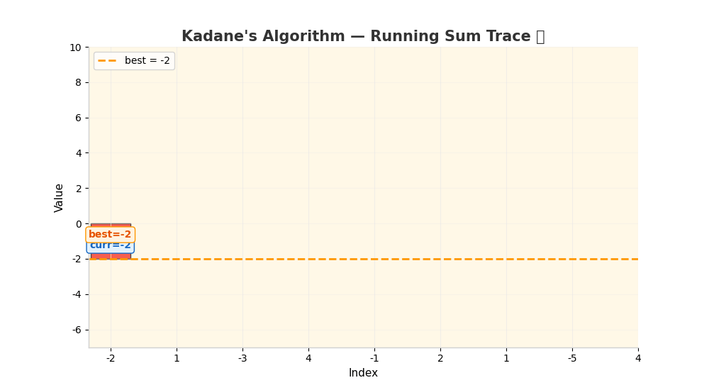

# LeetCode 53 — Maximum Subarray

> **Python 3 • Kadane's Algorithm • Beginner Friendly 🚀**

The goal of **LeetCode 53: Maximum Subarray** is to find the contiguous subarray with the largest sum and return its sum.

For example:

```text
Input:  [-2, 1, -3, 4, -1, 2, 1, -5, 4]
Output: 6
Explanation: [4, -1, 2, 1] has the largest sum = 6
```

The key observation is wonderfully simple:

- If the **current running sum becomes a burden** (negative), **drop it** and start fresh 🗑️
- Otherwise, **keep adding** and track the best sum you've seen 🏆

## 🎬 Little Animation



The animation shows the running `curr` (current sum) and `best` (maximum sum) while scanning the array from left to right. The golden-bordered bars highlight the best subarray found!

---

## 🐢 Brute-Force Solution

A straightforward brute-force idea is:

Try **every possible subarray** and compute its sum. Keep track of the maximum sum found.

### Python 3

```python
class Solution:
    def maxSubArray(self, nums: List[int]) -> int:
        n = len(nums)
        ans = float('-inf')

        for i in range(n):
            curr_sum = 0
            for j in range(i, n):
                curr_sum += nums[j]
                ans = max(ans, curr_sum)

        return ans
```

### Complexity

- **Time:** `O(n²)` ⏳ — every subarray is checked.
- **Space:** `O(1)` 💾 — only a few variables are used.

This works, but it recomputes overlapping sums repeatedly. That is the clue that an optimization is possible.

---

## 💡 Optimization Tips, Tricks & Hints

### Hint 1 — Do not recompute old work

When extending a subarray by one element, you don't need to resum everything. Just add the new element to the previous sum.

### Hint 2 — Drop negative baggage

If the current running sum is **less than the current element itself**, the old sum is dragging you down. Start fresh from the current element!

```python
curr = max(x, curr + x)
```

### Hint 3 — Track the best answer immediately

Whenever you update `curr`, check if it's the new champion:

```python
best = max(best, curr)
```

### Trick 🪄

Think of `curr` as your **current bank balance** 💰:

```text
Positive numbers → 💵 deposit money
Negative numbers → 💸 withdrawal
If balance goes negative → 🔄 reset to current transaction
```

The answer is simply the **richest you've ever been**!

---

## 🚀 Optimal Solution (Kadane's Algorithm)

The optimal solution scans the array exactly once.

```python
class Solution:
    def maxSubArray(self, nums: List[int]) -> int:
        best = curr = nums[0]

        for x in nums[1:]:
            curr = max(x, curr + x)
            best = max(best, curr)

        return best
```

### Why this is optimal

Each element is processed exactly once, so there is no repeated subarray summation.

The algorithm maintains only two integers:

- `curr` → the best sum ending at the current position
- `best` → the maximum sum seen so far

No auxiliary array is required because the problem asks only for the **maximum sum**, not the subarray itself.

---

## 🔎 Dry Run

For:

```text
nums = [-2, 1, -3, 4, -1, 2, 1, -5, 4]
```

The trace produces:

```text
x = -2 → curr = -2, best = -2
x =  1 → curr =  1, best =  1   (drop -2, start fresh!)
x = -3 → curr = -2, best =  1
x =  4 → curr =  4, best =  4   (drop -2, start fresh!)
x = -1 → curr =  3, best =  4
x =  2 → curr =  5, best =  5   🎉 new best!
x =  1 → curr =  6, best =  6   🏆 new best!
x = -5 → curr =  1, best =  6
x =  4 → curr =  5, best =  6
```

Therefore:

```text
Maximum subarray sum = 6 🎯
```

---

## 📊 Complexity

| Approach | Time | Space |
|---|---:|---:|
| 🐢 Brute force | `O(n²)` | `O(1)` |
| 🚀 Kadane's optimal | `O(n)` | `O(1)` |

### Final takeaway

> **Scan once, keep the best running sum, and drop it like it's hot when it goes negative.** ✨

This is a classic example of replacing repeated work with a simple running state.

---

## 🧠 Pattern to Remember

This problem is a great introduction to the **Kadane's Algorithm / running best** pattern:

```python
curr = max(x, curr + x)
best = max(best, curr)
```

The same mental model appears in many problems involving:

- Maximum subarray problems
- Stock trading (best time to buy/sell)
- Circular subarrays
- Matrix maximum subrectangles
- Dynamic programming with running state

Happy coding! 🐍💻🎉
