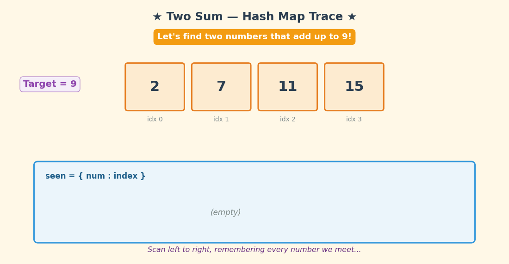

# LeetCode 1 — Two Sum

> **Python 3 • Hash Map • Beginner Friendly 🚀**

The goal of **LeetCode 1: Two Sum** is to find the **indices** of the two numbers in the array that add up to a given `target`.

For example:

```text
Input:  nums = [2, 7, 11, 15], target = 9
Output: [0, 1]
Explanation: nums[0] + nums[1] = 2 + 7 = 9, so we return [0, 1] 🎉
```

The key observation is wonderfully simple:

- For every number `num`, ask: **"Have I already seen its partner?"** 🤝
- The partner is simply `target - num` — we call it the **complement** 🧩
- If the complement is in our hash map → **we found the answer instantly!** ⚡
- If not → **store the current number** and keep scanning 🗺️

## 🎬 Little Animation



The animation shows the `seen` hash map filling up as we scan the array. The golden-bordered bars highlight the winning pair `[0, 1]`! 🏆

---

## 🐢 Brute-Force Solution

A straightforward brute-force idea is:

Try **every possible pair** of numbers and check if they add up to the target.

### Python 3

```python
class Solution:
    def twoSum(self, nums: List[int], target: int) -> List[int]:
        n = len(nums)

        for i in range(n):
            for j in range(i + 1, n):
                if nums[i] + nums[j] == target:
                    return [i, j]

        return []  # no pair found
```

### Complexity

- **Time:** `O(n²)` ⏳ — every pair is checked in the worst case.
- **Space:** `O(1)` 💾 — only a couple of loop variables are used.

This works, but it keeps re-asking the same question over and over: *"Does any earlier number pair with me?"* That repeated looking is the clue that a hash map can help!

---

## 💡 Optimization Tips, Tricks & Hints

### Hint 1 — Do not look backwards repeatedly

When you are at index `i`, every number before it has already been visited. Instead of scanning them again with an inner loop, **remember them the first time you see them**.

### Hint 2 — Ask for the complement, not the pair

For each number `num`, compute its **complement**:

```python
complement = target - num
```

If `complement` is already in your hash map, the pair is found instantly — no inner loop needed! 🎯

### Hint 3 — Store after checking (order matters!)

Check **before** you store. If you store first, a number might pair with itself (for example `target = 6` and `num = 3`)! 😱

```python
if complement in seen:
    return [seen[complement], i]   # ✅ check FIRST
seen[num] = i                       # ✅ store SECOND
```

### Trick 🪄

Think of the hash map as your **little black book of past crushes** 💌:

```text
Each new number  -> 💘 "Have we met before?"
complement       -> 🔍 the exact face it's looking for
seen[num] = i    -> 📇 save the number + its index for later
```

One scan, one lookup per number — that's the magic! ✨

---

## 🚀 Optimal Solution (Hash Map)

The optimal solution scans the array exactly **once**.

```python
class Solution:
    def twoSum(self, nums: List[int], target: int) -> List[int]:
        seen = {}

        for i, num in enumerate(nums):
            complement = target - num
            if complement in seen:
                return [seen[complement], i]
            seen[num] = i

        return []  # no pair found
```

### Why this is optimal

Each element is processed exactly once, and the hash map gives us an average `O(1)` lookup — no repeated scanning of old elements!

The algorithm maintains only one hash map:

- `seen` → maps each number to the index where we first met it 🗺️

We need the hash map because the problem asks for the **indices**, not just the values — so we must remember *where* each number lives.

---

## 🔎 Dry Run

For:

```text
nums = [2, 7, 11, 15], target = 9
```

The trace produces:

```text
i=0, num=2  → complement = 9-2 = 7   → 7 in seen? ❌ No  → seen = {2: 0}
i=1, num=7  → complement = 9-7 = 2   → 2 in seen? ✅ YES! seen[2] = 0
              → return [0, 1]  🎉
```

Therefore:

```text
Answer = [0, 1] 🎯
```

Notice how we found the answer on only the **second step** — no nested loops, no re-scanning! ⚡

---

## 📊 Complexity

| Approach | Time | Space |
|---|---:|---:|
| 🐢 Brute force | `O(n²)` | `O(1)` |
| 🚀 Hash map optimal | `O(n)` | `O(n)` |

### Final takeaway

> **Scan once, remember every number, and let the hash map do the looking.** ✨

This is a classic example of trading a little extra memory 💾 for a huge speed-up ⏩ — the hash map turns "search everything again" into "look it up instantly."

---

## 🧠 Pattern to Remember

This problem is a great introduction to the **Hash Map / Complement Lookup** pattern:

```python
complement = target - num
if complement in seen:
    return [seen[complement], i]
seen[num] = i
```

The same mental model appears in many problems involving:

- Two Sum variations (sorted array, multiple pairs, closest sum)
- Subarray sum equals K
- Longest harmonious subsequence
- Counting pairs with a given difference
- Anagram grouping and frequency counting

Happy coding! 🐍💻🎉
