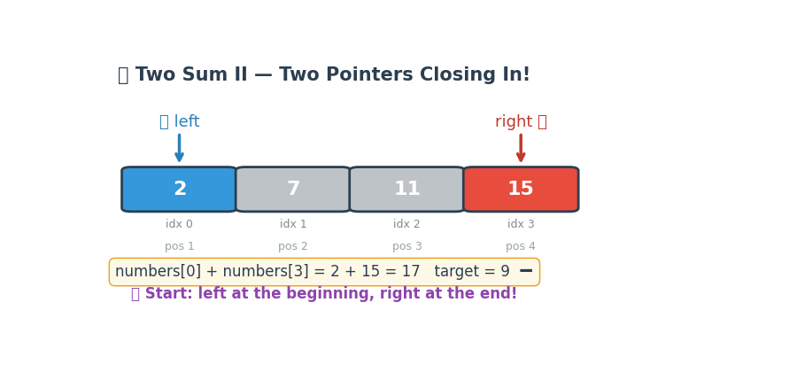

# LeetCode 167 — Two Sum II - Input Array Is Sorted

> **Python 3 • Two Pointers • Beginner Friendly 🚀**

The goal of **LeetCode 167** is to find **two numbers** in a **sorted array** `numbers` that add up to a given `target`, and return their **1-indexed** positions.

- The array is sorted in **ascending order** 📈
- Exactly **one solution** exists ✅
- You may **not** use the same element twice 🚫
- Return the answer as `[index1, index2]` where `index1 < index2` 🎯

For example:

```text
Input:  numbers = [2, 7, 11, 15], target = 9
Output: [1, 2]
Explanation: numbers[0] + numbers[1] = 2 + 7 = 9
             Return [1, 2] (1-indexed) 🎉
```

The key observation is wonderfully simple:

- Put `left` at the **start** and `right` at the **end** 🧲
- If the sum is **too small**, move `left` **right** ➡️ (need a bigger number)
- If the sum is **too big**, move `right` **left** ⬅️ (need a smaller number)
- The sorted order tells you **exactly which pointer to move** — no guessing! 🎯

## 🎬 Little Animation



The animation shows `left` 👈 and `right` 👉 starting at opposite ends and **closing in** on the answer like a zipper! 🤐 Watch how the sorted array tells us which pointer to move — no need to check every pair! 🧠

---

## 🐢 Brute-Force Solution

A straightforward brute-force idea is:

Check **every pair** of numbers with nested loops, and return the first pair that sums to `target`.

### Python 3

```python
from typing import List

class Solution:
    def twoSum(self, numbers: List[int], target: int) -> List[int]:
        n = len(numbers)

        for i in range(n):
            for j in range(i + 1, n):
                if numbers[i] + numbers[j] == target:
                    return [i + 1, j + 1]  # 1-indexed! ⭐

        return []  # no solution found
```

### Complexity

- **Time:** `O(n²)` ⏳ — we check all `n * (n - 1) / 2` pairs in the worst case.
- **Space:** `O(1)` 💾 — only a couple of loop variables.

This works, but it **ignores the sorted order** completely 💥 — we're doing way more work than we need to!

---

## 💡 Optimization Tips, Tricks & Hints

### Hint 1 — Use the sorted order! 📈

The array is **sorted ascending** — that's a huge clue! If the current sum is too small, the **only** way to grow it is to move `left` right. If it's too big, the **only** way to shrink it is to move `right` left. No need to try everything! 🎯

### Hint 2 — Start from both ends 🧲

Place `left = 0` and `right = n - 1`. This way, you start with the **smallest + biggest** possible sum — a perfect starting point for adjustments! ⚖️

### Hint 3 — Move ONE pointer at a time ⚠️

- Sum **too small**? → `left += 1` ➡️ (grab a bigger number)
- Sum **too big**? → `right -= 1` ⬅️ (grab a smaller number)
- Never move both — that would skip candidates! 🚫

### Trick 🪄

Think of it like **adjusting a shower** 🚿:

```text
Too cold?  -> 🔥 turn the hot water UP   (move left right ➡️)
Too hot?   -> 🧊 turn the cold water UP  (move right left ⬅️)
Just right -> 🎉 enjoy your perfect sum!
```

### Bonus Trick — One-liner magic ✨

```python
class Solution:
    def twoSum(self, numbers: List[int], target: int) -> List[int]:
        l, r = 0, len(numbers) - 1
        while numbers[l] + numbers[r] != target:
            l += numbers[l] + numbers[r] < target
            r -= numbers[l] + numbers[r] > target
        return [l + 1, r + 1]
```

*(Cute, but the classic `if/elif/else` is easier to read! 😄)*

---

## 🚀 Optimal Solution (Two Pointers)

The optimal solution makes **one pass** through the array — each step eliminates one candidate in `O(1)` time!

```python
from typing import List

class Solution:
    def twoSum(self, numbers: List[int], target: int) -> List[int]:
        left, right = 0, len(numbers) - 1

        while left < right:
            total = numbers[left] + numbers[right]

            if total == target:
                return [left + 1, right + 1]  # 1-indexed! ⭐
            elif total < target:
                left += 1   # sum too small -> need bigger ➡️
            else:
                right -= 1  # sum too big -> need smaller ⬅️

        return []  # guaranteed not to reach here per problem statement
```

### Why this is optimal

Each comparison **eliminates exactly one candidate**:

- If `total < target`, then `numbers[left]` paired with **any** element to its right is still too small — so `left` is safely discarded! 👋
- If `total > target`, then `numbers[right]` paired with **any** element to its left is still too big — so `right` is safely discarded! 👋

The algorithm maintains:

- `left` → the smallest candidate still in play 🔵
- `right` → the largest candidate still in play 🔴
- Each move shrinks the search space by one — like a zipper closing in! 🤐

We need no extra memory, no hash map, no sorting — just **two elegant pointers**! 🎯

---

## 🔎 Dry Run

For:

```text
numbers = [2, 7, 11, 15], target = 9
```

The trace produces:

```text
left = 0, right = 3:  2 + 15 = 17  -> too BIG  📈 -> right -= 1 ⬅️
left = 0, right = 2:  2 + 11 = 13  -> too BIG  📈 -> right -= 1 ⬅️
left = 0, right = 1:  2 + 7  = 9   -> MATCH!   🎉 -> return [1, 2] 🏆
```

For a trickier example:

```text
numbers = [1, 3, 4, 5, 7, 10], target = 11
```

```text
left = 0, right = 5:  1 + 10 = 11  -> MATCH! 🎉 -> return [1, 6] 🏆

Wow, first try! The two-pointer start (smallest + biggest)
can land on the answer immediately! ⚡
```

And one more where the answer hides in the middle:

```text
numbers = [2, 3, 4, 7, 8, 11], target = 10
```

```text
left = 0, right = 5:  2 + 11 = 13  -> too BIG  📈 -> right -= 1 ⬅️
left = 0, right = 4:  2 + 8  = 10  -> MATCH!   🎉 -> return [1, 5] 🏆

Notice we never even looked at 3, 4, or 7 — the sorted
order let us skip them with confidence! 🧠✨
```

---

## 📊 Complexity

| Approach | Time | Space |
|---|---:|---:|
| 🐢 Brute force | `O(n²)` | `O(1)` |
| 🚀 Two Pointers | `O(n)` | `O(1)` |

### Final takeaway

> **Start from both ends, and let the sorted order tell you which way to move.** ✨

This is a classic example of the **Two Pointers** pattern — when the array is sorted, you can often replace an `O(n²)` search with a sleek `O(n)` walk from both ends! 🚶‍♂️🚶‍♀️

---

## 🧠 Pattern to Remember

This problem is a great introduction to the **Two Pointers** pattern:

```python
def twoSum(numbers, target):
    left, right = 0, len(numbers) - 1
    while left < right:
        total = numbers[left] + numbers[right]
        if total == target:
            return [left + 1, right + 1]
        elif total < target:
            left += 1
        else:
            right -= 1
```

The same mental model appears in many problems involving:

- Sorted arrays and pair-finding 🔍
- Container With Most Water 🪣
- 3Sum (fix one, two-pointer the rest) 🎯
- Partitioning arrays ⚖️
- Palindrome checking 🔄
- Merging sorted lists 🔗

Happy coding! 🐍💻🎉
