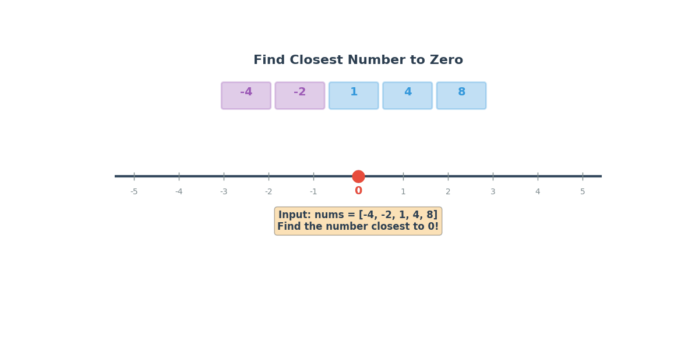

# LeetCode 2239 — Find Closest Number to Zero

> **Python 3 • Linear Scan • Beginner Friendly 🚀**

The goal of **LeetCode 2239** is to find the number in an integer array `nums` that is **closest to 0** ✅

If there are **multiple** answers, return the number with the **largest value** 🎯

For example:

```text
Input:  nums = [-4, -2, 1, 4, 8]
Output: 1
Explanation: The distance from -4 to 0 is |-4| = 4 📏
             The distance from -2 to 0 is |-2| = 2 📏
             The distance from 1 to 0 is |1| = 1 📏
             And 1 is the smallest distance! 🎉
```

```text
Input:  nums = [2, -1, 1]
Output: 1
Explanation: Both 1 and -1 have the same distance of 1 from 0 🤝
             But the problem says: if there's a tie, return the LARGER number!
             So we return 1, not -1! 😄
```

The key observation is wonderfully simple:

- The **distance** from a number `x` to 0 is just `abs(x)` — the absolute value! 📏
- We want the number with the **smallest absolute value** 🎯
- If two numbers have the **same absolute value** (like `-3` and `3`), pick the **positive** one! ➕
- One pass through the array is all we need! 🏃‍♂️💨

## 🎬 Little Animation



The animation shows a **ruler** 📏 sliding across the number line, measuring each number's distance to zero! Watch how the **champion** 👑 gets replaced whenever a closer challenger appears — and how ties are broken by picking the **bigger, sunnier** number! ☀️

---

## 🐢 Brute-Force Solution

A straightforward brute-force idea is:

**Sort** the array by absolute value, and then handle the tie-break rule! 🧹

### Python 3

```python
class Solution:
    def findClosestNumber(self, nums: List[int]) -> int:
        # Sort by absolute value — smallest distance first! 📏
        # If tie in distance, larger number comes first! ➕
        nums.sort(key=lambda x: (abs(x), -x))
        return nums[0]  # The champion is at the front! 👑
```

### Complexity

- **Time:** `O(n log n)` ⏳ — Sorting takes `O(n log n)`, which is more expensive than a single scan!
- **Space:** `O(n)` or `O(log n)` 💾 — Depending on the sorting algorithm used under the hood.

This works, but we're doing **extra work** 💥 — sorting the *entire* array when we only care about finding **one** number! The single-pass scan does it all in **one go**! 🎯

---

## 💡 Optimization Tips, Tricks & Hints

### Hint 1 — Distance = Absolute Value! 📏

The distance from any number `x` to 0 on the number line is simply `abs(x)`! No need for fancy formulas — just wrap it in `abs()`! 🎁

### Hint 2 — Track the Champion! 👑

Keep a running "best answer so far" — call it `ans`. For each new number `x`, ask:

- Is `x` **closer** to 0 than `ans`? (`abs(x) < abs(ans)`) → **Crown it!** 👑
- Is it a **tie** in distance? (`abs(x) == abs(ans)`) → Pick the **bigger** number! ➕

### Hint 3 — Don't Forget the Tie-Breaker! ⚠️

When `abs(x) == abs(ans)`, the problem says to return the **larger** value. So `-3` vs `3`? Pick `3`! 🌞 The positive number always wins the tie! 🏆

### Trick 🪄

Think of it like a **tug-of-war** on the number line 🪢:

```text
Zero is in the middle! 🎯
-5 .......... 0 .......... 5
 Each number pulls toward itself!
 Whoever is CLOSEST to 0 wins! 🏅
 If two are equally close? The POSITIVE one wins! 😎
```

### Bonus Trick — One-liner with min() ✨

```python
class Solution:
    def findClosestNumber(self, nums: List[int]) -> int:
        return min(nums, key=lambda x: (abs(x), -x))
```

*(Elegant, Pythonic, and interview-ready! 😄)*

---

## 🚀 Optimal Solution (Single Pass)

The optimal solution makes **one pass** through the array — each element is checked exactly once!

```python
class Solution:
    def findClosestNumber(self, nums: List[int]) -> int:
        ans = nums[0]  # 👑 our current champion!

        for x in nums:
            # Is x closer to 0? 📏
            # OR is it a tie but x is bigger? ➕
            if abs(x) < abs(ans) or (abs(x) == abs(ans) and x > ans):
                ans = x  # New champion! 👑

        return ans  # 🎉 The closest (and biggest on ties) number!
```

### Why this is optimal

Each element is processed **exactly once**:

- **Compare** `abs(x)` with `abs(ans)` — `O(1)` 🔍
- **Possibly update** `ans` — `O(1)` ✏️

We never need to:

- Sort the array 🚫
- Look back at previous elements 🚫
- Use extra data structures 🚫

Just one smooth, single pass — like walking down a line of contestants and crowning the winner on the spot! 🏃‍♂️👑

---

## 🔎 Dry Run

For:

```text
nums = [-4, -2, 1, 4, 8]
```

The trace produces:

```text
Start: ans = -4 👑

x = -4:  abs(-4) = 4, abs(ans) = 4
         Tie! But -4 > -4? No! Keep ans = -4 👑

x = -2:  abs(-2) = 2, abs(ans) = 4
         2 < 4! Closer! ans = -2 👑

x = 1:   abs(1) = 1, abs(ans) = 2
         1 < 2! Closer! ans = 1 👑

x = 4:   abs(4) = 4, abs(ans) = 1
         4 > 1! Not closer! Keep ans = 1 👑

x = 8:   abs(8) = 8, abs(ans) = 1
         8 > 1! Not closer! Keep ans = 1 👑

Return 1 ✅🎉
```

For the tie-breaker example:

```text
nums = [2, -1, 1]
```

```text
Start: ans = 2 👑

x = 2:   abs(2) = 2, abs(ans) = 2
         Tie! But 2 > 2? No! Keep ans = 2 👑

x = -1:  abs(-1) = 1, abs(ans) = 2
         1 < 2! Closer! ans = -1 👑

x = 1:   abs(1) = 1, abs(ans) = 1
         Tie! But 1 > -1? YES! ans = 1 👑

Return 1 ✅🎉

The tie was broken by picking the LARGER number! 😎
```

And one more with negatives:

```text
nums = [-3, -2, -1]
```

```text
Start: ans = -3 👑

x = -3:  abs(-3) = 3, abs(ans) = 3
         Tie! But -3 > -3? No! Keep ans = -3 👑

x = -2:  abs(-2) = 2, abs(ans) = 3
         2 < 3! Closer! ans = -2 👑

x = -1:  abs(-1) = 1, abs(ans) = 2
         1 < 2! Closer! ans = -1 👑

Return -1 ✅🎉

All negatives, but -1 is closest to zero! 🎯
```

---

## 📊 Complexity

| Approach | Time | Space |
|---|---:|---:|
| 🐢 Brute force (sort) | `O(n log n)` | `O(n)` |
| 🚀 Single pass | `O(n)` | `O(1)` |

### Final takeaway

> **Track the champion, compare absolute distances, and let ties go to the bigger number.** ✨

This is a classic example of the **Single Pass** pattern — when you only need the *best* element and not a fully sorted order, one scan with a running champion is all you need! 🎯

---

## 🧠 Pattern to Remember

This problem is a great introduction to the **Running Champion** pattern:

```python
def findClosestNumber(nums):
    ans = nums[0]
    for x in nums:
        if abs(x) < abs(ans) or (abs(x) == abs(ans) and x > ans):
            ans = x
    return ans
```

The same mental model appears in many problems involving:

- Finding minimum/maximum with custom rules 🏆
- Tracking best candidates in a stream 🌊
- Problems with tie-breaking conditions ⚖️
- Selection without full sorting 🎯
- Greedy one-pass algorithms 🏃‍♂️

Happy coding! 🐍💻🎉
