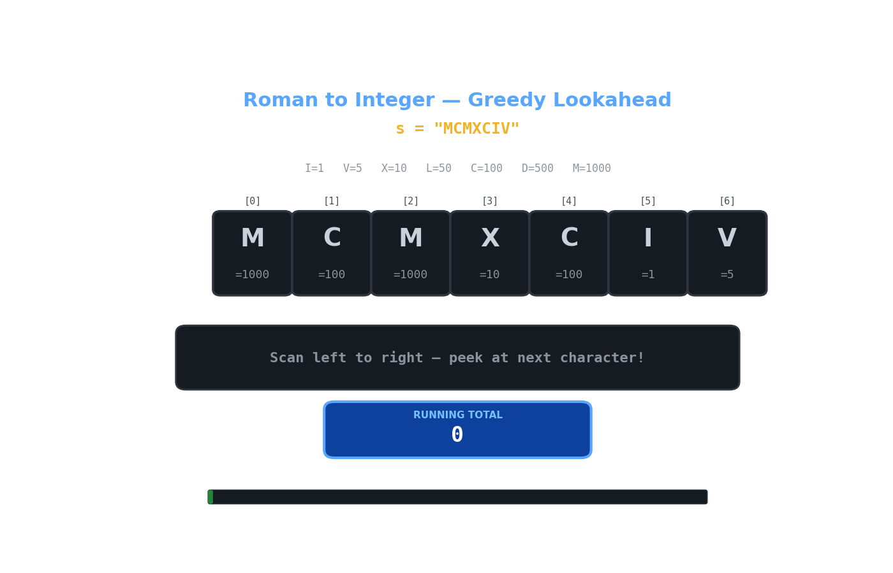

# LeetCode 13 — Roman to Integer

> **Python 3 • Greedy • Beginner Friendly 🚀**

The goal of **LeetCode 13** is to convert a **Roman numeral** string `s` into its **integer value**! 🏛️✨

A Roman numeral is **valid** if:

- It's a string of characters from `I, V, X, L, C, D, M` 🔤
- It represents a number from **1 to 3999** 🔢
- **Smaller values before larger values** mean **subtraction** ➖
- **Larger or equal values after** mean **addition** ➕

For example:

```text
Input:  s = "III"
Output: 3
Explanation: I + I + I = 1 + 1 + 1 = 3! Simple! 😄
```

```text
Input:  s = "IV"
Output: 4
Explanation: I before V means 5 - 1 = 4! Clever! 🎉
```

```text
Input:  s = "IX"
Output: 9
Explanation: I before X means 10 - 1 = 9! ✨
```

```text
Input:  s = "LVIII"
Output: 58
Explanation: L = 50, V = 5, III = 3 → 50 + 5 + 3 = 58! 🏛️
```

```text
Input:  s = "MCMXCIV"
Output: 1994
Explanation: M = 1000, CM = 900, XC = 90, IV = 4 → 1994! 🎊
```

The key observation is wonderfully simple:

- We scan the string **left to right** 🔍
- If a **smaller numeral comes before a larger one**, we **subtract** it ➖
- Otherwise, we **add** it ➕
- The **next character** tells us whether to add or subtract! 🎯

## 🎬 Little Animation



The animation shows the **running total** growing as we scan the string! 🌊 Watch how we:

- **Add the value** when the next numeral is **smaller or equal** ➕
- **Subtract the value** when the next numeral is **larger** ➖
- **Build up the total** one character at a time! 📊
- **Handle subtraction cases** like `IV`, `IX`, `XL`, `XC`, `CD`, `CM`! 🎭

---

## 🐢 Brute-Force Solution

A straightforward brute-force idea is:

Check **every pair of adjacent numerals** explicitly, and handle all **6 subtraction cases** separately! 🎲

### Python 3

```python
class Solution:
    def romanToInt(self, s: str) -> int:
        values = {
            'I': 1, 'V': 5, 'X': 10, 'L': 50,
            'C': 100, 'D': 500, 'M': 1000
        }

        # Handle all subtraction cases explicitly! 🎯
        subtract_cases = {
            'IV': 4, 'IX': 9,    # I before V or X ➖
            'XL': 40, 'XC': 90,  # X before L or C ➖
            'CD': 400, 'CM': 900 # C before D or M ➖
        }

        total = 0
        i = 0

        while i < len(s):
            # Check if this is a subtraction case! 🔍
            if i + 1 < len(s) and s[i:i+2] in subtract_cases:
                total += subtract_cases[s[i:i+2]]  # Add the combined value! ➕
                i += 2  # Skip both characters! ⏭️
            else:
                total += values[s[i]]  # Just add the single value! ➕
                i += 1  # Move to next! ⏭️

        return total
```

### Complexity

- **Time:** `O(n)` ⏳ — We scan the string once, checking pairs.
- **Space:** `O(1)` 💾 — We only store the value mappings and subtraction cases.

This works, but it **hardcodes all 6 subtraction cases** 💥 — what if the pattern was more complex? The greedy solution **handles it elegantly** with just a comparison! 🎯

---

## 💡 Optimization Tips, Tricks & Hints

### Hint 1 — Look at the next character! 👀

The **key insight** is beautifully simple:

- If `values[s[i]] < values[s[i+1]]` → **subtract** `values[s[i]]` ➖
- Otherwise → **add** `values[s[i]]` ➕

### Hint 2 — The golden rules! 📊

- **Rightmost character** is **always added** (no next to compare) ➕
- **Subtraction happens** only when a **smaller numeral precedes a larger one** ➖
- **No need to hardcode** `IV`, `IX`, etc. — just **compare values**! 🎯

### Hint 3 — Think about it differently! 🧠

Instead of remembering all subtraction cases, ask:

> "Is this numeral **worth less** than the **next one**?"

- If **YES** → it must be **subtracted** (like `I` in `IV`) ➖
- If **NO** → it must be **added** (like `V` in `VI`) ➕

### Trick 🪄

Think of it like **shopping with coupons** 🛍️:

```text
You're adding up prices left to right:
- If the next item is MORE expensive → this is a DISCOUNT! Subtract! 🏷️
- If the next item is same or less → just add the price! 💰

"I see a $1 item, next is $5" → That's a $4 discount! 🎉
"I see a $5 item, next is $1" → Just add $5! 💵
```

### Bonus Trick — Visualize the decision! 📈

```python
# For "MCMXCIV":
# M  → next is C (100 < 1000)? No → add 1000    ➕
# C  → next is M (100 < 1000)? Yes → subtract 100 ➖
# M  → next is X (1000 < 10)? No → add 1000      ➕
# X  → next is C (10 < 100)? Yes → subtract 10    ➖
# C  → next is I (100 < 1)? No → add 100         ➕
# I  → next is V (1 < 5)? Yes → subtract 1        ➖
# V  → no next → add 5                           ➕
# Total: 1000 - 100 + 1000 - 10 + 100 - 1 + 5 = 1994 ✅
```

The comparison tells us everything — no need to memorize subtraction pairs! 🎯

---

## 🚀 Optimal Solution (Greedy)

The optimal solution uses **one elegant comparison** — no hardcoded subtraction cases needed! 🎯

```python
class Solution:
    def romanToInt(self, s: str) -> int:
        values = {
            'I': 1, 'V': 5, 'X': 10, 'L': 50,
            'C': 100, 'D': 500, 'M': 1000
        }

        total = 0

        for i in range(len(s)):
            # If next numeral is larger, subtract current! ➖
            if i + 1 < len(s) and values[s[i]] < values[s[i + 1]]:
                total -= values[s[i]]
            else:
                # Otherwise, add it! ➕
                total += values[s[i]]

        return total
```

### Why this is optimal

We **never look back or store extra state**:

- We make **one pass** through the string 🔁
- We only need to **peek at the next character** 👀
- The **comparison** `values[s[i]] < values[s[i+1]]` captures **all subtraction logic** in one line! ✨
- **No hardcoded cases** — the pattern emerges naturally! 🌊

The greedy approach **collapses 6 subtraction rules** into a single comparison! 🎯

We solve it in **one pass** with **constant space** — that's the power of **Greedy** algorithms! 🌊✨

---

## 🔎 Dry Run

For:

```text
s = "MCMXCIV"
```

The trace produces:

```text
Start: total = 0

Char 1: 'M' (1000)
  Next: 'C' (100)
  1000 < 100? No → total = 0 + 1000 = 1000    ➕

Char 2: 'C' (100)
  Next: 'M' (1000)
  100 < 1000? Yes → total = 1000 - 100 = 900   ➖

Char 3: 'M' (1000)
  Next: 'X' (10)
  1000 < 10? No → total = 900 + 1000 = 1900    ➕

Char 4: 'X' (10)
  Next: 'C' (100)
  10 < 100? Yes → total = 1900 - 10 = 1890     ➖

Char 5: 'C' (100)
  Next: 'I' (1)
  100 < 1? No → total = 1890 + 100 = 1990      ➕

Char 6: 'I' (1)
  Next: 'V' (5)
  1 < 5? Yes → total = 1990 - 1 = 1989         ➖

Char 7: 'V' (5)
  No next → total = 1989 + 5 = 1994            ➕

Final: 1994 ✅ Perfect!
```

For `s = "LVIII"`:

```text
Start: total = 0

Char 1: 'L' (50)
  Next: 'V' (5)
  50 < 5? No → total = 0 + 50 = 50             ➕

Char 2: 'V' (5)
  Next: 'I' (1)
  5 < 1? No → total = 50 + 5 = 55              ➕

Char 3: 'I' (1)
  Next: 'I' (1)
  1 < 1? No → total = 55 + 1 = 56              ➕

Char 4: 'I' (1)
  Next: 'I' (1)
  1 < 1? No → total = 56 + 1 = 57              ➕

Char 5: 'I' (1)
  No next → total = 57 + 1 = 58                ➕

Final: 58 ✅ Perfect!
```

---

## 📊 Complexity

| Approach | Time | Space |
|---|---:|---:|
| 🐢 Brute force (hardcoded cases) | `O(n)` | `O(1)` |
| 🚀 Greedy (next-character comparison) | `O(n)` | `O(1)` |

Both are linear, but the greedy solution is **more elegant**! 🚀

- **Brute force** needs **6 hardcoded subtraction cases** — brittle and verbose! 💥
- **Greedy** needs **just one comparison** — clean and maintainable! 🎯

### Final takeaway

> **Look ahead to the next character, and let one comparison decide add or subtract.** ✨

This is a classic example of the **Greedy** pattern — when the future determines the present, just peek ahead! 🌊

---

## 🧠 Pattern to Remember

This problem is a great introduction to the **Greedy Lookahead** pattern:

```python
for i in range(len(s)):
    if i + 1 < len(s) and values[s[i]] < values[s[i + 1]]:
        total -= values[s[i]]   # ➖ Next is bigger → subtract!
    else:
        total += values[s[i]]   # ➕ Next is same/smaller → add!
```

The same mental model appears in many problems involving:

- String parsing with context 🔤
- Lookahead-based decisions 👀
- Accumulator patterns 📊
- Signal processing with thresholds 📈
- Game state evaluation 🎮

Happy coding! 🐍💻🎉
