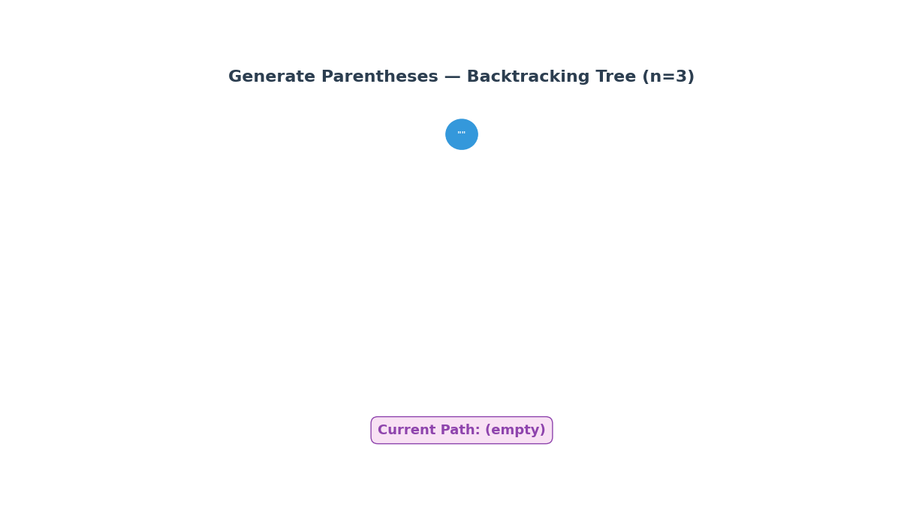

# LeetCode 22 — Generate Parentheses

> **Python 3 • Backtracking • Beginner Friendly 🚀**

The goal of **LeetCode 22** is to generate **all combinations** of well-formed parentheses given `n` pairs! 🎨

A string is **well-formed** if:

- Every **opening bracket** `(` has a **matching closing bracket** `)` 🧩
- Brackets are **closed in the correct order** 📦 (no crossing allowed!)
- We use **exactly `n` opening** and **`n` closing** brackets ⚖️

For example:

```text
Input:  n = 3
Output: ["((()))","(()())","(())()","()(())","()()()"]
Explanation: These are all 5 valid combinations of 3 pairs of parentheses! 🎉
```

```text
Input:  n = 1
Output: ["()"]
Explanation: Only one way to arrange a single pair! 😄
```

The key observation is wonderfully simple:

- We build the string **character by character** 🔨
- At each step, we have **two choices**: add `(` or add `)` 🤔
- But we must follow the **rules**:
  - We can add `(` only if we haven't used all `n` openers ⬇️
  - We can add `)` only if there are **more openers than closers** (something to close!) 🔒
- When the string reaches length `2n`, we found a valid combination! ✅

## 🎬 Little Animation



The animation shows the **backtracking tree** growing as we explore all possible paths! 🌳 Watch how we:

- **Add `(`** (green edges) when we still have openers left 💚
- **Add `)`** (orange edges) only when there's an unmatched opener 🧡
- **Backtrack** (remove the last edge) when a path is complete or invalid ↩️
- **Collect** valid combinations at the bottom leaves! 🍂✨

---

## 🐢 Brute-Force Solution

A straightforward brute-force idea is:

Generate **all possible combinations** of `n` opening and `n` closing brackets (every possible arrangement), then **filter** out the invalid ones! 🎲

### Python 3

```python
from itertools import permutations

class Solution:
    def generateParenthesis(self, n: int) -> list[str]:
        def is_valid(s: str) -> bool:
            balance = 0
            for char in s:
                if char == '(':
                    balance += 1
                else:
                    balance -= 1
                if balance < 0:  # More closers than openers! ❌
                    return False
            return balance == 0  # Perfectly balanced! ✅

        # Generate all permutations of n '(' and n ')'
        chars = ['('] * n + [')'] * n
        unique_combinations = set(permutations(chars))

        result = []
        for combo in unique_combinations:
            s = ''.join(combo)
            if is_valid(s):  # Keep only the valid ones! ✅
                result.append(s)

        return result
```

### Complexity

- **Time:** `O((2n)! / (n! × n!) × n)` ⏳ — We generate all `C(2n, n)` combinations and validate each in `O(n)` time. That's a LOT of combinations! 💥
- **Space:** `O(n)` 💾 — For the recursion stack and validation.

This works, but it **generates many invalid combinations** 💥 — for `n = 3`, we generate 20 combinations but only 5 are valid! We're doing **4x more work** than needed! The backtracking solution **never generates invalid strings**! 🎯

---

## 💡 Optimization Tips, Tricks & Hints

### Hint 1 — Think about the choices at each step! 🧠

At any point while building the string, ask yourself:

- **Can I add `(`?** → Yes, if I haven't used all `n` openers! ⬇️
- **Can I add `)`?** → Yes, if there are **more openers than closers** (something waiting to be closed)! 🔒

### Hint 2 — Track your counts! 📊

Keep track of:

- `open_count` → how many `(` we've used so far ⬇️
- `close_count` → how many `)` we've used so far 🔒

The **golden rule**: `close_count` can never exceed `open_count`! 🏆

### Hint 3 — When to stop? 🛑

Stop when the string length reaches `2n` — that's when we've used all `n` pairs! Add it to the result and **backtrack**! ↩️

### Trick 🪄

Think of it like **building a staircase** 🪜:

```text
Step 1: Place a '(' — you're going UP! ⬆️
Step 2: Place another '(' — going higher! ⬆️⬆️
Step 3: Place a ')' — coming down! ⬇️
Step 4: Place a ')' — back to ground! ⬇️

You can never go BELOW ground level (negative balance)! 🚫
And you must end exactly at ground level (balance = 0)! 🎯
```

You can't close more brackets than you've opened — just like you can't go below the ground floor! 🏢

### Bonus Trick — Visualize the balance! 📈

```python
# For "((()))":
# ( → balance = 1  ⬆️
# ( → balance = 2  ⬆️⬆️
# ( → balance = 3  ⬆️⬆️⬆️
# ) → balance = 2  ⬇️
# ) → balance = 1  ⬇️
# ) → balance = 0  ✅ Perfect!
```

The balance never goes negative and ends at zero — that's the secret sauce! 🥘

---

## 🚀 Optimal Solution (Backtracking)

The optimal solution builds **only valid strings** from the start — no wasted effort, no invalid combinations! 🎯

```python
class Solution:
    def generateParenthesis(self, n: int) -> list[str]:
        result = []  # 🎁 our collection of valid combinations!

        def backtrack(s, open_count, close_count):
            # 🛑 Base case: string is complete!
            if len(s) == 2 * n:
                result.append(s)  # 🎉 Found a valid combination!
                return

            # ⬇️ Choice 1: Add an opening bracket (if we have any left)
            if open_count < n:
                backtrack(s + "(", open_count + 1, close_count)

            # 🔒 Choice 2: Add a closing bracket (only if something to close)
            if close_count < open_count:
                backtrack(s + ")", open_count, close_count + 1)

        backtrack("", 0, 0)  # 🚀 Start with an empty string!
        return result
```

### Why this is optimal

We **never generate invalid strings**:

- We only add `(` when we **have openers left** ⬇️
- We only add `)` when there's an **unmatched opener** 🔒
- Every path leads to a **valid combination** — no wasted work! ✅

The backtracking **prunes** invalid branches before they even start! ✂️

We only explore valid paths — that's the power of **Backtracking**! 🌳✨

---

## 🔎 Dry Run

For:

```text
n = 2
```

The trace produces:

```text
Start: s = "", open = 0, close = 0

Step 1: Add '('  → s = "(", open = 1, close = 0   ⬇️
Step 2: Add '('  → s = "((", open = 2, close = 0  ⬇️
Step 3: Add ')'  → s = "(()", open = 2, close = 1  🔒
Step 4: Add ')'  → s = "(())", open = 2, close = 2  🔒
         ✅ Valid! Add to result!

Backtrack to Step 3, try adding ')' instead... 
  Already at close = 1, open = 2, can add ')' ✓
  But we already did that! Backtrack more! ↩️

Backtrack to Step 2, try adding ')' instead:
Step 3': Add ')'  → s = "()", open = 1, close = 1  🔒
Step 4': Add '('  → s = "()(", open = 2, close = 1  ⬇️
Step 5': Add ')'  → s = "()()", open = 2, close = 2  🔒
         ✅ Valid! Add to result!

Final result: ["(())", "()()"] 🎉
```

For `n = 3`:

```text
All valid combinations:
1. ((()))  ⬆️⬆️⬆️⬇️⬇️⬇️
2. (()())  ⬆️⬆️⬇️⬆️⬇️⬇️
3. (())()  ⬆️⬆️⬇️⬇️⬆️⬇️
4. ()(())  ⬆️⬇️⬆️⬆️⬇️⬇️
5. ()()()  ⬆️⬇️⬆️⬇️⬆️⬇️

5 beautiful patterns! 🎨✨
```

---

## 📊 Complexity

| Approach | Time | Space |
|---|---:|---:|
| 🐢 Brute force (permutations) | `O(4^n / √n)` | `O(n)` |
| 🚀 Backtracking | `O(4^n / √n)` | `O(n)` |

Wait — same time complexity? 🤔

Yes! The **Catalan number** `C(n) = (2n)! / ((n+1)! × n!)` gives us the number of valid combinations, which is approximately `4^n / (n√π)`. So even our optimal solution must generate all of them! 

But here's the difference:
- **Brute force** generates **all `C(2n, n)` combinations** (~2x more for n=3, ~6x more for n=5!) and then filters 💥
- **Backtracking** generates **only valid ones** — no wasted memory or validation time! 🎯

### Final takeaway

> **Build only what's valid, and let backtracking explore all the right paths.** ✨

This is a classic example of the **Backtracking** pattern — when you need to explore all valid combinations, prune invalid branches early! 🌳

---

## 🧠 Pattern to Remember

This problem is a great introduction to the **Backtracking** pattern:

```python
def backtrack(s, open_count, close_count):
    if len(s) == 2 * n:
        result.append(s)
        return

    if open_count < n:
        backtrack(s + "(", open_count + 1, close_count)

    if close_count < open_count:
        backtrack(s + ")", open_count, close_count + 1)
```

The same mental model appears in many problems involving:

- Generating all valid combinations 🎨
- Subset and permutation problems 🔢
- N-Queens puzzle 👑
- Sudoku solver 🔢
- Word search in a grid 🔤
- Pathfinding in mazes 🌀

Happy coding! 🐍💻🎉
