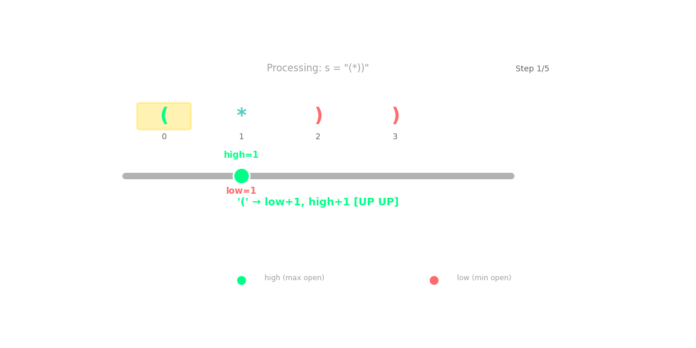

# LeetCode 678 — Valid Parenthesis String

> **Python 3 • Greedy • Beginner Friendly 🚀**

The goal of **LeetCode 678** is to determine if a string `s` containing `(`, `)`, and `*` is a **valid parenthesis string**! 🎨

A string is **valid** if:

- Every **opening bracket** `(` has a **matching closing bracket** `)` 🧩
- Brackets are **closed in the correct order** 📦 (no crossing allowed!)
- The `*` character can be treated as `'('`, `')'`, or an **empty string** `""` ✨

For example:

```text
Input:  s = "()"
Output: true
Explanation: Simple and straightforward! 😄
```

```text
Input:  s = "(*))"
Output: true
Explanation: Treat '*' as '(' → "(())" is valid! 🎉
```

```text
Input:  s = "(*)"
Output: true
Explanation: Treat '*' as '' → "()" is valid! ✨
```

```text
Input:  s = "(((*)"
Output: false
Explanation: No way to balance this one! ❌
```

The key observation is wonderfully simple:

- We scan the string **character by character** 🔍
- The `*` gives us **flexibility** — it can be anything! 🤹
- We track the **range of possible open brackets** using `low` and `high` 📊
- If `high` ever goes **negative**, we have too many `)` — impossible! 🚫
- At the end, `low` must be **zero** — meaning we can balance perfectly! ✅

## 🎬 Little Animation



The animation shows the **greedy range** shrinking and expanding as we scan the string! 🌊 Watch how we:

- **Add to both `low` and `high`** when we see `(` 💚
- **Shrink both** when we see `)` 🧡
- **Expand the range** when we see `*` — it can be anything! ✨
- **Keep `low` at zero** — we can't have negative open brackets! 🛡️
- **Check if `high` goes negative** — too many closers! 🚫

---

## 🐢 Brute-Force Solution

A straightforward brute-force idea is:

Try **every possible combination** of what `*` could be, and check if any combination is valid! 🎲

### Python 3

```python
class Solution:
    def checkValidString(self, s: str) -> bool:
        def is_valid(candidate: str) -> bool:
            balance = 0
            for char in candidate:
                if char == '(':
                    balance += 1
                else:
                    balance -= 1
                if balance < 0:  # More closers than openers! ❌
                    return False
            return balance == 0  # Perfectly balanced! ✅

        def backtrack(index: int, current: list) -> bool:
            if index == len(s):
                return is_valid(''.join(current))

            if s[index] == '*':
                # Try all three possibilities! 🎲
                for replacement in ['(', ')', '']:
                    current.append(replacement)
                    if backtrack(index + 1, current):
                        return True
                    current.pop()
            else:
                current.append(s[index])
                if backtrack(index + 1, current):
                    return True
                current.pop()

            return False

        return backtrack(0, [])
```

### Complexity

- **Time:** `O(3^k × n)` ⏳ — Where `k` is the number of `*` characters. We try 3 possibilities for each `*` and validate each in `O(n)` time. That's EXPONENTIAL! 💥
- **Space:** `O(n)` 💾 — For the recursion stack.

This works, but it **tries way too many combinations** 💥 — for a string with 10 `*` characters, that's `3^10 = 59,049` possibilities! The greedy solution **solves it in one pass**! 🎯

---

## 💡 Optimization Tips, Tricks & Hints

### Hint 1 — Think about the range of possibilities! 🧠

Instead of trying every combination, track the **range** of possible open brackets:

- **`low`** → the **minimum** possible open brackets (treat `*` as `)` or `''`) ⬇️
- **`high`** → the **maximum** possible open brackets (treat `*` as `'('`) ⬆️

### Hint 2 — The golden rules! 📊

- When we see `(`: **both `low` and `high` increase** ⬆️⬆️
- When we see `)`: **both `low` and `high` decrease** ⬇️⬇️
- When we see `*`: **`low` decreases** (as `)`), **`high` increases** (as `(`) 🔄
- **`low` can never go below 0** — clamp it! 🛡️
- **`high` can never go below 0** — if it does, return `False`! 🚫

### Hint 3 — When to stop? 🛑

- If **`high < 0`** at any point → too many `)`, impossible! ❌
- At the end, check if **`low == 0`** → we can balance perfectly! ✅

### Trick 🪄

Think of it like **managing a budget** 💰:

```text
You have a bank account with a range of possible balances:
- Minimum balance (low) = worst case scenario 📉
- Maximum balance (high) = best case scenario 📈

'(' → You earn money! Both go UP! 💰⬆️
')' → You spend money! Both go DOWN! 💸⬇️
'*' → You might earn OR spend! Range EXPANDS! 🔄

Your minimum balance can never go below $0 (overdraft!) 🛡️
If your maximum balance goes below $0 → you're bankrupt! 💥
At the end, minimum balance must be exactly $0! ✅
```

### Bonus Trick — Visualize the range! 📈

```python
# For "(*))":
# Start: low = 0, high = 0
# ( → low = 1, high = 1    ⬆️⬆️
# * → low = 0, high = 2    🔄 (range expands!)
# ) → low = 0, high = 1    ⬇️ (low clamped at 0!)
# ) → low = 0, high = 0    ⬇️ (perfectly balanced!)
# ✅ Valid!
```

The range tells us all possible scenarios — if the best case can't survive, nothing can! 🎯

---

## 🚀 Optimal Solution (Greedy)

The optimal solution tracks the **range of possible open brackets** in a single pass — no backtracking needed! 🎯

```python
class Solution:
    def checkValidString(self, s: str) -> bool:
        low = high = 0  # 📊 Range of possible open brackets

        for ch in s:
            if ch == '(':
                low += 1      # ⬆️ Must have one more open
                high += 1     # ⬆️ Best case: one more open
            elif ch == ')':
                low = max(0, low - 1)   # ⬇️ Worst case: one less open (clamped!)
                high -= 1               # ⬇️ Best case: one less open
            else:  # '*'
                low = max(0, low - 1)   # 🔄 '*' as ')' or ''
                high += 1               # 🔄 '*' as '('

            if high < 0:  # 🚫 Too many closers! Impossible!
                return False

        return low == 0  # ✅ Can we balance perfectly?
```

### Why this is optimal

We **never try multiple combinations**:

- We track the **entire range** of possibilities in two variables 📊
- `low` represents the **worst case** (minimum possible open brackets) 📉
- `high` represents the **best case** (maximum possible open brackets) 📈
- If even the **best case** fails (`high < 0`), no combination can work! 🚫
- If the **worst case** succeeds (`low == 0`), some combination works! ✅

The greedy approach **collapses all possibilities** into a simple range check! ✨

We solve it in **one pass** — that's the power of **Greedy** algorithms! 🌊✨

---

## 🔎 Dry Run

For:

```text
s = "(*))"
```

The trace produces:

```text
Start: low = 0, high = 0

Char 1: '('
  low = 1, high = 1    ⬆️⬆️ (must have open bracket)

Char 2: '*'
  low = max(0, 0) = 0  🔄 (treat as ')')
  high = 2             🔄 (treat as '(')
  Range: [0, 2]

Char 3: ')'
  low = max(0, -1) = 0 ⬇️ (clamped!)
  high = 1             ⬇️
  Range: [0, 1]

Char 4: ')'
  low = max(0, -1) = 0 ⬇️ (clamped!)
  high = 0             ⬇️
  Range: [0, 0]

Final: low = 0 ✅ Perfectly balanced!
Result: True 🎉
```

For `s = "(((*)"`:

```text
Start: low = 0, high = 0

Char 1: '(' → low = 1, high = 1    ⬆️
Char 2: '(' → low = 2, high = 2    ⬆️⬆️
Char 3: '(' → low = 3, high = 3    ⬆️⬆️⬆️
Char 4: '*' → low = 2, high = 4    🔄
Char 5: ')' → low = 1, high = 3    ⬇️

Final: low = 1 ❌ Can't balance!
Result: False 💥
```

---

## 📊 Complexity

| Approach | Time | Space |
|---|---:|---:|
| 🐢 Brute force (backtracking) | `O(3^k × n)` | `O(n)` |
| 🚀 Greedy (range tracking) | `O(n)` | `O(1)` |

The difference is MASSIVE! 🚀

- **Brute force** tries **3^k combinations** — exponential explosion! 💥
- **Greedy** tracks just **two numbers** — linear and constant space! 🎯

### Final takeaway

> **Track the range of possibilities, and let greedy collapse them into two numbers.** ✨

This is a classic example of the **Greedy** pattern — when you need to track possibilities, sometimes a range is all you need! 🌊

---

## 🧠 Pattern to Remember

This problem is a great introduction to the **Greedy Range** pattern:

```python
low = high = 0

for ch in s:
    if ch == '(':
        low += 1
        high += 1
    elif ch == ')':
        low = max(0, low - 1)
        high -= 1
    else:  # '*'
        low = max(0, low - 1)
        high += 1

    if high < 0:
        return False

return low == 0
```

The same mental model appears in many problems involving:

- Validating strings with wildcards 🔤
- Range tracking problems 📊
- Interval problems 📏
- Stock trading with constraints 📈
- Resource allocation problems 💰

Happy coding! 🐍💻🎉
